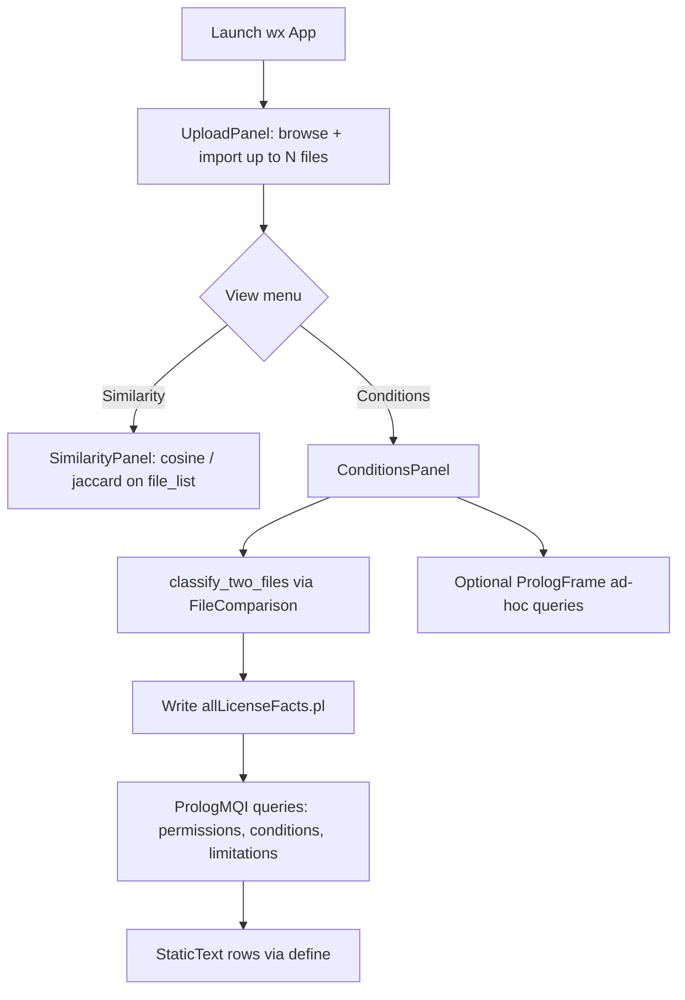

# Make It Compliant — Architecture (Current State)

This document describes the repository **as audited** before the production upgrade. It is the baseline for incremental refactors (Python package layout, UI polish, Prolog cleanup, CI, Windows `.exe`, and GitHub Pages).

---

## 1. Purpose

**Make It Compliant** helps users analyze software license text by:

1. **Classifying** uploaded license files against a corpus of known license templates (ML/text similarity).
2. **Comparing** two license texts (cosine and Jaccard similarity).
3. **Explaining** permissions, distribution/modification conditions, and limitations for the classified licenses via a **SWI-Prolog** knowledge base.

The app does **not** perform legal advice; it encodes SPDX-style license metadata as Prolog facts and surfaces human-readable explanations in the UI.

---

## 2. Repository layout (high level)

```text
makeitcompliantpython/
├── ComplianceSystemForSoftwareLicensingGui.py   # Primary desktop entry (wxPython)
├── main.py                                      # Alternate entry (Eel local web UI)
├── FileComparison.py                            # ML similarity + Prolog bridge (monolith)
├── allLicenseFactsBaseCopy.pl                   # Canonical Prolog KB (do not mutate at runtime)
├── allLicenseFacts.pl                           # Generated KB + license_a / license_b facts
├── license_templates/                           # 45 full-text license files (.txt)
├── web/                                         # Eel frontend assets (not static GH Pages today)
├── MIT-License.txt, RandomLicense1/2.txt        # Sample / test license text
├── README.md                                    # Minimal (wxPython install only)
└── docs/
    └── ARCHITECTURE.md                          # This file
```

**Not present today:** `requirements.txt`, `pyproject.toml`, `tests/`, GitHub Actions, PyInstaller spec, packaged `makeitcompliant/` package, or a `docs/` site beyond this file.

---

## 3. Entry points and run modes

| Entry | Technology | How to run (intended) | Role |
|-------|------------|----------------------|------|
| `ComplianceSystemForSoftwareLicensingGui.py` | **wxPython** | `python ComplianceSystemForSoftwareLicensingGui.py` | **Main desktop app** — upload, similarity, conditions, Prolog console |
| `main.py` | **Eel** (Chromium + Python) | `python main.py` | **Secondary local web UI** — upload/classify/compare in browser via embedded server |

Both depend on **`FileComparison.py`** for similarity and (in the wx app) Prolog queries.

### 3.1 Desktop flow (wxPython)



- **Global state:** module-level `file_list` in `ComplianceSystemForSoftwareLicensingGui.py` (not encapsulated).
- **Panel switching:** menu-driven show/hide; panels are sometimes re-created on each navigation (see TODO in source).
- **Conditions page** calls `getClassifiedFiles()` → `FileComparison.classify_two_files()` which rewrites `allLicenseFacts.pl` and queries Prolog.

### 3.2 Web flow (Eel)

```mermaid
flowchart TD
    Start[python main.py] --> EelInit[eel.init web]
    EelInit --> Browser[eel.start upload.html]
    Browser --> JS[uploadpage.js FileReader]
    JS --> PyCompare[@eel.expose compare]
    JS --> PyClassify[@eel.expose classify]
    PyCompare --> FC[FileComparison cosine / jaccard]
    PyClassify --> FC2[FileComparison + template scan]
```

- **No Prolog** in the Eel path: `main.py` only exposes similarity and template classification (threshold `> 0.95` in `classify`).
- Requires **Eel**, a browser, and Python running locally — **not** deployable as static GitHub Pages without a rewrite.

---

## 4. Python modules

### 4.1 `ComplianceSystemForSoftwareLicensingGui.py`

| Component | Responsibility |
|-----------|----------------|
| `UploadPanel` | File dialog, read file into `file_list` as `{name, value}` |
| `SimilarityPanel` | Compare first two entries with cosine/Jaccard (expects ≥2 files) |
| `ConditionsPanel` | Classify two licenses, query Prolog, render permissions/conditions/limitations |
| `MyFrame` | Menu bar, panel container, `getClassifiedFiles()` |
| `PrologFrame` | REPL-style Prolog query UI → `FileComparison.query()` |

**Dependencies:** `wx`, `FileComparison`, `os`.

**Known fragility:**

- `viewSimilarityPanel` / `viewConditionsPanel` reference `self.conditions_panel` before it may exist (first visit to Similarity can raise if `conditions_panel` is still `None`).
- No validation that exactly two files are loaded before similarity/conditions.

### 4.2 `main.py`

- Initializes Eel with folder `web/`.
- Exposes `compare(sent_files)` and `classify(sent_file)` to JavaScript.
- Unused import: `PrologMQI` (not used in this file).
- `eel.start("upload.html", mode="None")` — desktop window mode for Eel.

### 4.3 `FileComparison.py` (core logic monolith)

| Function | Purpose |
|----------|---------|
| `preprocess_text` / `vectorizer` | NLTK tokenization + sklearn `TfidfVectorizer` (English stop words) |
| `cosine_similarity` | TF-IDF cosine between two strings |
| `jaccard_similarity` | Token-set Jaccard on whitespace-split words |
| `file_to_string` | Read lines from path (unused by GUI currently) |
| `classify` | Best template match → write `license_a(...)` only → return name |
| `classify_two_files` | Best match per file → write `license_a` + `license_b` → return names |
| `get_permissions` | Query `license_a_permission(X)`, `license_b_permission(X)` |
| `get_conditions_for_distribution` | `license_*_conditions_before_distribution(X)` |
| `get_conditions_for_modification` | `license_*_conditions_before_modification(X)` |
| `get_limitations` | `license_*_limitation(X)` |
| `query` | Ad-hoc Prolog query after `consult(allLicenseFacts.pl)` |
| `define` | Map Prolog atom strings to English descriptions for UI |

**Runtime dependencies (implicit, not pinned):**

- `nltk` (downloads `punkt` on import)
- `sklearn`
- `swiplserver` → **SWI-Prolog** must be installed and on PATH for MQI

**Side effects:**

- Overwrites **`allLicenseFacts.pl`** in the process working directory on every classify.
- Downloads NLTK data on first import.

### 4.4 Planned target layout (upgrade)

The refactor target described in the project brief:

```text
makeitcompliant/
  app/
    main.py
    gui/          # wx_app.py, components.py, styles.py
    core/         # compliance_engine, license_models, file_comparison, validation
    prolog/       # engine.py, facts_loader.py
    ml/           # classifier.py, features.py
    utils/        # paths.py, logging.py
tests/
docs/
web/
```

Mapping from current code:

| Current | Target (planned) |
|---------|------------------|
| `ComplianceSystemForSoftwareLicensingGui.py` | `app/gui/wx_app.py` + `components.py` |
| `FileComparison.py` (similarity) | `app/ml/` + `app/core/file_comparison.py` |
| `FileComparison.py` (Prolog) | `app/prolog/engine.py`, `facts_loader.py` |
| `define()` | `app/core/license_models.py` or i18n layer |
| `main.py` + `web/` | optional `app/web/` or separate static GH Pages site |

---

## 5. Prolog knowledge base

### 5.1 Files

| File | Role |
|------|------|
| `allLicenseFactsBaseCopy.pl` | **Source of truth** (~528 lines): facts for ~44 license names + inference rules |
| `allLicenseFacts.pl` | **Runtime artifact**: base copy + dynamic `license_a("...")` / `license_b("...")` (or placeholders) |

**Generation (Python):**

```python
# Single license (classify):
base + 'license_a("<name>").'

# Two licenses (classify_two_files):
base + 'license_a("<name_a>").\n' + base + 'license_b("<name_b>").'  # note: base duplicated — see §8
```

Classification strips `.txt` from template filenames and uses the **filename stem** as the Prolog atom (e.g. `MIT License.txt` → `"MIT License"`).

### 5.2 Ontology (conceptual)

**Unary license facts** (license name as first argument):

- Permissions: `can_use_commercially/1`, `can_distribute/1`, `can_modify/1`, `can_use_privately/1`, `patent_use/1`
- Some `can_distribute/1` and `can_modify/1` clauses have **conditions** in the rule body via `condition/1` helper (legacy pattern in KB).
- Conditions storage: `has_condition(License, Atom)` for atoms like `disclose_source_code`, `same_license`, etc.
- Limitations: `limitation_liability/1`, `limitation_patent_use/1`, `limitation_warranty/1`, `limitation_trademark_use/1`

**Derived predicates:**

- `permission/2`, `conditions_before_distribution/2`, `conditions_before_modification/2`, `limitation/2`

**Session bindings** (appended at runtime):

- `license_a(Name).`, `license_b(Name).`

**License-scoped queries** (used by Python):

```prolog
license_a_permission(Y) :- license_a(X), permission(X, Y).
license_b_permission(Y) :- license_b(X), permission(X, Y).
% ... same pattern for conditions and limitations
```

### 5.3 Python ↔ Prolog bridge

- Library: [`swiplserver`](https://github.com/SWI-Prolog/swiplserver-python) **`PrologMQI`**
- Each call: new MQI instance → `consult("allLicenseFacts.pl")` → `query/1`
- Working directory must contain the generated `.pl` file (fragile for packaged `.exe` unless paths are fixed).

### 5.4 Prolog quality notes (for later steps)

- Large duplicated fact lists per license — candidate for `license_metadata/2` or external data files.
- `condition(none).` and commented `condition/1` block — incomplete normalization.
- **Name alignment** between `license_templates/` filenames and Prolog strings is critical; several mismatches exist (§8).

---

## 6. ML / text comparison logic

| Technique | Where | Use |
|-----------|-------|-----|
| **TF-IDF + cosine** | `FileComparison.cosine_similarity` | Template classification; pairwise comparison |
| **Jaccard** (whitespace tokens) | `FileComparison.jaccard_similarity` | Pairwise comparison only |
| **Threshold** | `main.py` `classify` | Only updates best if `compare_value > 0.95` |
| **Max score** | `classify` / `classify_two_files` in `FileComparison` | Always pick highest cosine vs all templates (no minimum threshold) |

**Template corpus:** `license_templates/` — **45** `.txt` files (full license text).

**Classification label:** filename without `.txt` must match a quoted string in Prolog facts, or Prolog queries return empty/false.

There is **no** separate trained classifier model (no pickle/onnx); “ML” here is **unsupervised similarity** via sklearn + NLTK preprocessing.

---

## 7. UI layer

### 7.1 Desktop (wxPython)

- Single frame ~600×550, menu **View** → Upload / Similarity / Conditions.
- Minimal styling (bold underlined headers, wrapped `StaticText`).
- **Prolog Console** secondary frame for power users.
- No icons, themes, accessibility, or progress/error dialogs beyond defaults.

### 7.2 Web (`web/`)

| Asset | Purpose |
|-------|---------|
| `upload.html` | Main Eel page: file input, classify/compare buttons, results div, canvas |
| `uploadpage.js` | Client state `fileArray`, calls `eel.classify` / `eel.compare` |
| `uploadpage.css` | Basic button/layout styles |
| `drawScript.js` | Decorative canvas curves (not compliance-related) |
| `SimilarityPage.html` | **Stale Eel tutorial** (`process_input` not implemented in `main.py`) |

**Broken / incomplete web items:**

- Nav link to **`home.html`** — file does not exist.
- `uploadpage.js` uses `eel.expose` on **JavaScript** functions (`doUpload`, `classifyJS`) — incorrect Eel pattern (expose is for Python callbacks).
- `classifyJS` / `compareJS` button handlers are not wired consistently with Eel’s Python exposes (`classify` / `compare` on Python side).
- React-style `className` in HTML attribute (ignored by browser).

### 7.3 GitHub Pages feasibility

| Capability | Desktop + Prolog | Static GH Pages |
|------------|------------------|-----------------|
| Full KB reasoning | Yes (SWI-Prolog) | **No** (no WASM Prolog in repo today) |
| TF-IDF classify/compare | Yes (Python/sklearn) | **Partial** — could port to JS with precomputed template vectors |
| License explanations | Yes (`define/1` + Prolog) | **Demo** — ship JSON derived from KB |

**Recommended split (upgrade):**

- **GitHub Pages:** marketing/docs + static demo (precomputed license metadata, client-side similarity demo, clear “full analysis requires desktop app”).
- **Windows `.exe`:** full Prolog + sklearn + templates (PyInstaller/cx_Freeze with bundled SWI-Prolog or documented install prerequisite).

---

## 8. Known issues and technical debt (audit)

1. **`classify_two_files` writes base KB twice** for `license_b` (lines 86–89 in `FileComparison.py`) — duplicates entire fact file in `allLicenseFacts.pl`; should append only `license_a` and `license_b` lines once.
2. **License name mismatches** between templates and Prolog:
   - Template file: `University of Illinios-NCSA Open Source License.txt` (typo) vs Prolog: `University of Illinois-NCSA Open Source License` vs committed `allLicenseFacts.pl`: `University of Illinois/NCSA Open Source License`.
   - CERN templates use **Licence** in filenames; Prolog uses **License**.
3. **`allLicenseFacts.pl` vs `allLicenseFactsBaseCopy.pl` drift:** e.g. `limitation(X, patent_use)` vs `limitation(X, l_patent_use)` — Python `define()` expects `l_patent_use`.
4. **Global `file_list`** — not thread-safe, not test-friendly.
5. **NLTK download on import** — bad for offline/CI; should be lazy or vendored.
6. **No dependency manifest** — reproducible installs and CI blocked.
7. **Working-directory-relative paths** — breaks when launched from another cwd or from a frozen executable.
8. **Eel web UI** unmaintained relative to wx app; missing Prolog integration.
9. **No automated tests** for similarity, fact generation, or Prolog queries.
10. **Conditions panel** may crash if navigated before two files uploaded or if `conditions_panel` is `None`.

---

## 9. Data assets

| Path | Count | Notes |
|------|-------|-------|
| `license_templates/*.txt` | 45 | Ground truth text for classification |
| `allLicenseFactsBaseCopy.pl` | 1 | ~44 license entities in facts (some templates may lack facts) |
| Sample licenses | `MIT-License.txt`, `RandomLicense1.txt`, `RandomLicense2.txt` | Manual testing |

---

## 10. Build and deployment targets (current vs planned)

| Target | Current state | Planned |
|--------|---------------|---------|
| **Windows `.exe`** | Not configured | PyInstaller (or similar) bundling Python, wx, templates, `.pl`, and SWI-Prolog or installer prerequisite |
| **GitHub Pages** | Not configured | Static `web/` or `docs/site/` + demo mode; link to desktop release |
| **CI (GitHub Actions)** | None | Lint, test, optional Prolog smoke tests, build artifact |
| **Dependencies** | README: `pip install -U wxPython` only | `requirements.txt` / `pyproject.toml` with wxPython, eel, nltk, scikit-learn, swiplserver |

**Implicit runtime requirements:**

- Python 3.x (version not documented)
- SWI-Prolog (for desktop conditions + console)
- wxPython (desktop)
- Eel + Chrome/Edge (web entry)
- Internet (first NLTK `punkt` download)

---

## 11. Upgrade roadmap (cross-reference)

Work is intentionally **incremental**; after each step the app should remain runnable.

| Step | Focus |
|------|--------|
| **1** (this doc) | Audit + `docs/ARCHITECTURE.md` |
| **2** | Package layout (`makeitcompliant/app/...`), path utilities, thin wrappers |
| **3** | Prolog: fix fact generation, name normalization, optional module split |
| **4** | ML: shared classifier API, thresholds, tests with fixture licenses |
| **5** | UI/UX: wx themes, validation, error states; revive or replace Eel web |
| **6** | Windows `.exe` + release workflow |
| **7** | GitHub Pages static site + demo |
| **8** | Tests + GitHub Actions + expanded README/docs |

---

## 12. Quick reference — “what runs what”

```text
User uploads 2 licenses (wx)
    → file_list
    → View → Conditions
        → classify_two_files (TF-IDF best template × 2)
        → write allLicenseFacts.pl
        → PrologMQI: license_a_* / license_b_* queries
        → define(atom) → human-readable UI strings

User runs main.py (Eel)
    → browser upload.html
    → eel.compare / eel.classify (Python)
    → FileComparison only (no Prolog)
```

---

*Last updated: audit pass before production upgrade (Step 1).*
